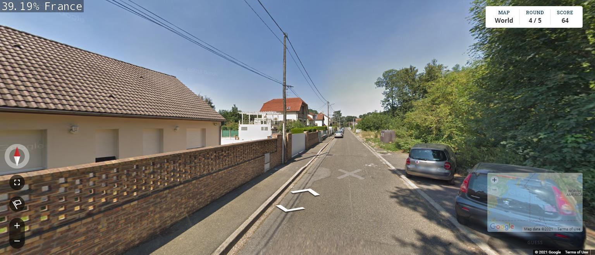

# geoguessr-ai

A project intended to determine the location of images.

## Algorithm

The AI is built on the ImageNet image classification model, re-trained with a Geoguessr dataset using resnet-18 and PyTorch.

## Setup

1. Clone or download the repository to a folder of your choice.

2. `cd` into the folder with your console.

3. Run the command below, replacing `[IMAGE PATH]` with the path of the file of your choice:
`imagenet.py --model=models/resnet18.onnx --labels=data/labels.txt --input_blob=input_0 --output_blob=output_0 [IMAGE PATH] output.jpg`

4. When the command finishes, an output image will appear in your folder.

[Here is a video demonstration of my project](link)
